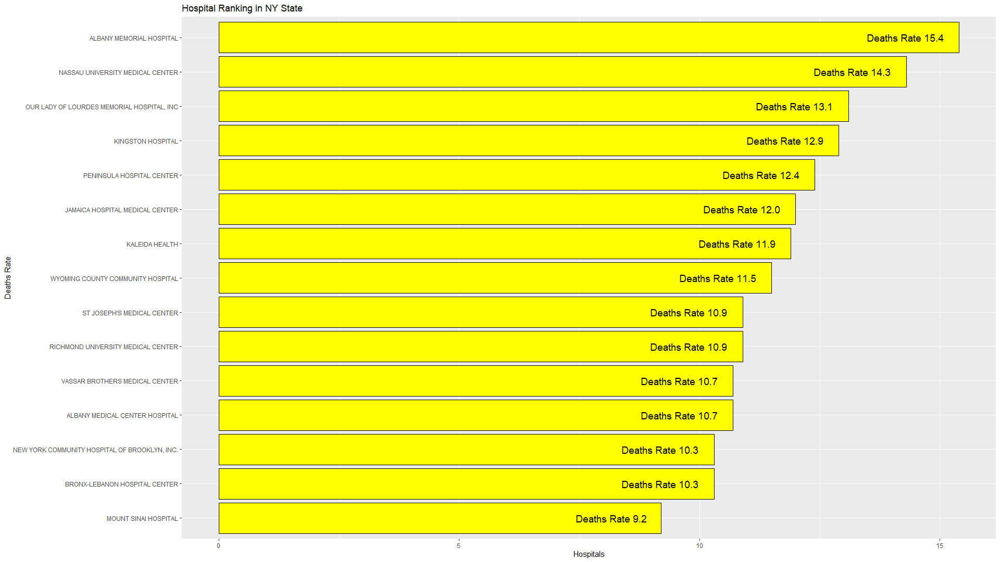

# R Programming Practice

This repository contains a collection of R programming practice projects, including data analysis, visualizations and manipulation using R. The goal is to showcase and apply various data analysis techniques and generate meaningful insights using real-world datasets.

 - I learn to basics of R along with necessary data structures and modern libraries like tidyverse for data manipulation and data visualization. Moreover, I also toke a course from coursera for a proper track.

## Samples

